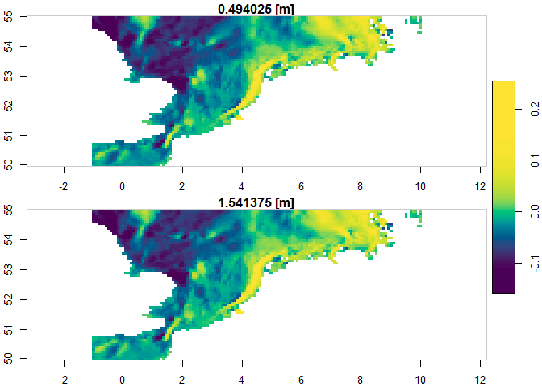

> `{CopernicusMarine}` Easily access information from
> <https://data.marine.copernicus.eu>
> [](https://CRAN.R-project.org/package=CopernicusMarine)
> 

## Overview

<a href="https://github.com/pepijn-devries/CopernicusMarine/"></a>

[Copernicus Marine Service
Information](https://marine.copernicus.eu/about) is a programme
subsidised by the European Commission. Its mission is to provide free
authoritative information on the oceans physical and biogeochemical
state. The `{CopernicusMarine}` R package is developed apart from this
programme and facilitates retrieval of information from
<https://data.marine.copernicus.eu>. With the package you can:

-   List available marine data for Copernicus and provide
    meta-information.
-   Download and use the data directly in R.

## Why use `{CopernicusMarine}`

Previously, there was only a MOTU client available for Python.
Therefore, automating Copernicus downloads in R used to require
installation of python and its
[motuclient](https://pypi.org/project/motuclient/) package. The
`{CopernicusMarine}` R package has a much simpler installation procedure
(see below) and does not depend on third party software.

## Installation

> Get CRAN version

``` r
install.packages("CopernicusMarine")
```

> Get development version on github

``` r
devtools::install_github('pepijn-devries/CopernicusMarine')
```

## Usage

The package provides an interface between R and the Copernicus Marine
services. Note that for some of these services you need an account and
have to comply with [specific
terms](https://marine.copernicus.eu/user-corner/service-commitments-and-licence).
The usage section briefly shows three different ways of obtaining data
from Copernicus:

-   [Using the MOTU server](#sec-motu)
-   [Using the FTP server](#sec-ftp)
-   [Using the WMS server](#sec-wms)

Please check the manual for complete documentation of the package.

<h3 id="sec-motu">
Subsetting data using MOTU server
</h3>

The code below assumes that you have registered your account details
using `option(CopernicusMarine_uid = "my_user_name")` and
`option(CopernicusMarine_pwd = "my_password")`. If you are comfortable
that it is secure enough, you can also store these options in your
`.Rprofile` such that they will be loaded each session. Otherwise, you
can also provide your account details as arguments to the functions.

The example below demonstrates how to subset a specific layer for a
specific product. The subset is constrained by the `region`,
`timerange`, `verticalrange` and `sub_variables` arguments. The subset
is downloaded to the temporary file specified with `destination` and can
be read using the [`{stars}`](https://r-spatial.github.io/stars/)
package.

``` r
destination <- tempfile("copernicus", fileext = ".nc")

copernicus_download_motu(
  destination   = destination,
  product       = "GLOBAL_ANALYSISFORECAST_PHY_001_024",
  layer         = "cmems_mod_glo_phy-cur_anfc_0.083deg_P1D-m",
  variable      = "sea_water_velocity",
  output        = "netcdf",
  region        = c(-1, 50, 10, 55),
  timerange     = c("2021-01-01", "2021-01-02"),
  verticalrange = c(0, 2),
  sub_variables = c("uo", "vo")
)
#> Logging in onto MOTU server...
#> Preparing download...
#> Downloading file...
#> Done

mydata <- stars::read_stars(destination)
#> vo, uo,

plot(mydata["vo"], col = hcl.colors(100), axes = TRUE)
```

<!-- -->

<h3 id="sec-ftp">
Downloading a complete Copernicus marine product
</h3>

If you don’t want to subset the data and want the complete set, you can
use the File Transfer Protocol (FTP) if that service is available for
your product. First you can list files available for a specific product:

``` r
cop_ftp_files <- copernicus_ftp_list("GLOBAL_ANALYSISFORECAST_PHY_001_024", "cmems_mod_glo_phy-cur_anfc_0.083deg_P1D-m")
cop_ftp_files
#> # A tibble: 1,113 x 8
#>    flags        len protocol       size month   day time  url                   
#>    <chr>      <int> <chr>         <dbl> <chr> <int> <chr> <chr>                 
#>  1 -rw-rw-r--     1 ftp      1937968861 Oct      14 2022  ftp://nrt.cmems-du.eu~
#>  2 -rw-rw-r--     1 ftp      1937978851 Oct      14 2022  ftp://nrt.cmems-du.eu~
#>  3 -rw-rw-r--     1 ftp      1937888467 Oct      14 2022  ftp://nrt.cmems-du.eu~
#>  4 -rw-rw-r--     1 ftp      1938380754 Oct      14 2022  ftp://nrt.cmems-du.eu~
#>  5 -rw-rw-r--     1 ftp      1938177028 Oct      14 2022  ftp://nrt.cmems-du.eu~
#>  6 -rw-rw-r--     1 ftp      1938234339 Oct      14 2022  ftp://nrt.cmems-du.eu~
#>  7 -rw-rw-r--     1 ftp      1938285902 Oct      14 2022  ftp://nrt.cmems-du.eu~
#>  8 -rw-rw-r--     1 ftp      1937954892 Oct      14 2022  ftp://nrt.cmems-du.eu~
#>  9 -rw-rw-r--     1 ftp      1937964478 Oct      14 2022  ftp://nrt.cmems-du.eu~
#> 10 -rw-rw-r--     1 ftp      1937962443 Oct      14 2022  ftp://nrt.cmems-du.eu~
#> # i 1,103 more rows
```

Downloading the first file can be done with
`copernicus_ftp_get(cop_ftp_files$url[[1]], tempdir())`, where the file
would be stored in a temporary directory. By default the progress is
printed as files can be very large and may take some time to download.

<h3 id="sec-wms">
Copernicus Web Map Services (WMS)
</h3>

Web Map Services (WMS) allow to quickly plot pre-rendered images onto a
map. This may not be useful when you need the data for analyses but is
handy for quick visualisations, inspection or presentation of data. In R
it is very easy to add WMS layers to an interactive map using
[leaflet](https://rstudio.github.io/leaflet/) widgets. This is
demonstrated with the example below (note that in the documentation the
map is only shown statically and is not interactive).

``` r
leaflet::leaflet() %>%
  leaflet::setView(lng = 3, lat = 54, zoom = 4) %>%
  leaflet::addProviderTiles("Esri.WorldImagery") %>%
  addCopernicusWMSTiles(
    product     = "GLOBAL_ANALYSISFORECAST_PHY_001_024",
    layer       = "cmems_mod_glo_phy-thetao_anfc_0.083deg_P1D-m",
    variable    = "thetao"
  )
```

<!-- -->

When you want to use WMS tiles in static plots, you could download and
store specific regions of the tiles as a [geo-referenced
tiff](https://en.wikipedia.org/wiki/GeoTIFF) file for future use. Use
`copernicus_wms2geotiff` for that purpose.

Note that the WMS functions may not work on systems that don’t support
GDAL utils.

### Citing the data you use

A Copernicus account comes with several terms of use. One of these is
that you [properly
cite](https://help.marine.copernicus.eu/en/articles/4444611-how-to-cite-copernicus-marine-products-and-services)
the data you use in publications. In fact, we also have credit the data
used in this documentation, which can be easily done with the following
code:

``` r
copernicus_cite_product("GLOBAL_ANALYSISFORECAST_PHY_001_024")
#> $doi
#> [1] "E.U. Copernicus Marine Service Information; Global Ocean Physics Analysis and Forecast - GLOBAL_ANALYSISFORECAST_PHY_001_024 (2016-10-14). DOI:10.48670/moi-00016"
```

## Resources

-   [E.U. Copernicus Marine Service
    Information](https://data.marine.copernicus.eu)
-   [Global Ocean Physics Analysis and Forecast -
    GLOBAL_ANALYSISFORECAST_PHY_001_024 (2016-10-14);
    DOI:10.48670/moi-00016](https://doi.org/10.48670/moi-00016)
