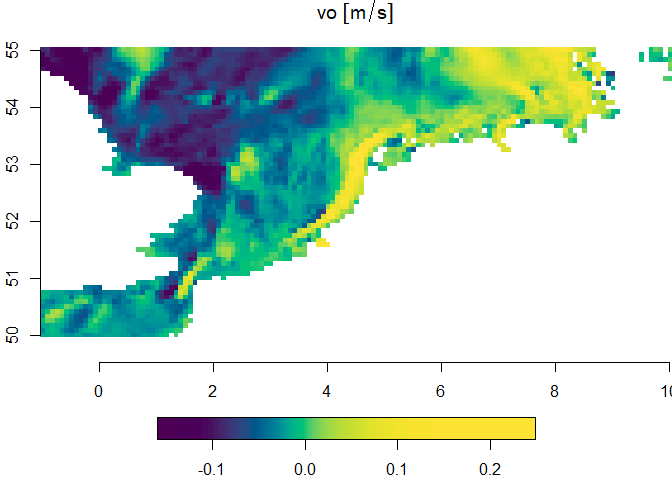
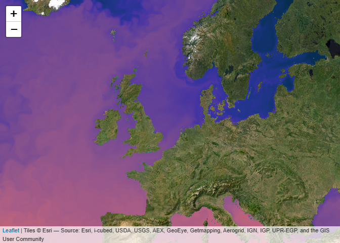

> `{CopernicusMarine}` Easily access information from
> <https://data.marine.copernicus.eu>
> [](https://CRAN.R-project.org/package=CopernicusMarine)
> 

## Overview

<a href="https://github.com/pepijn-devries/CopernicusMarine/"></a>

[Copernicus Marine Service
Information](https://marine.copernicus.eu/about) is a programme
subsidised by the European Commission. Its mission is to provide free
authoritative information on the oceans physical and biogeochemical
state. The `{CopernicusMarine}` R package is developed apart from this
programme and facilitates retrieval of information from
<https://data.marine.copernicus.eu>. With the package you can:

- List available marine data for Copernicus and provide
  meta-information.
- Download and use the data directly in R.

## Why use `{CopernicusMarine}`

Copernicus Marine offers access to their data services through a [Python
application
interface](https://pypi.org/project/copernicus-marine-client/). For R
users this requires complex installation procedures and is difficult to
maintain in a stable R package. The `{CopernicusMarine}` R package has a
much simpler installation procedure (see below) and does not depend on
third party software, other than packages available from
[CRAN](https://cran.r-project.org/).

## Installation

> Get CRAN version

``` r
install.packages("CopernicusMarine")
```

> Get development version on github

``` r
devtools::install_github('pepijn-devries/CopernicusMarine')
```

## Usage

The package provides an interface between R and the Copernicus Marine
services. Note that for some of these services you need an account and
have to comply with [specific
terms](https://marine.copernicus.eu/user-corner/service-commitments-and-licence).
The usage section briefly shows three different ways of obtaining data
from Copernicus:

- [Downloading a subset](#sec-subset)
- [Downloading a full dataset](#sec-full)
- [Using the WMTS server](#sec-wtms)

Please check the manual for complete documentation of the package.

<h3 id="sec-subset">
Downloading a subset
</h3>

The code below assumes that you have registered your account details
using `options(CopernicusMarine_uid = "my_user_name")` and
`options(CopernicusMarine_pwd = "my_password")`. If you are comfortable
that it is secure enough, you can also store these options in your
`.Rprofile` such that they will be loaded each session. Otherwise, you
can also provide your account details as arguments to the functions.

The example below demonstrates how to subset a specific layer for a
specific product. The subset is constrained by the `region`, `timerange`
and `verticalrange` arguments. The subset is downloaded to the temporary
file specified with `destination` and can be read using the
[`{stars}`](https://r-spatial.github.io/stars/) package.

``` r
destination <- tempfile("copernicus", fileext = ".nc")

cms_download_subset(
  destination   = destination,
  product       = "GLOBAL_ANALYSISFORECAST_PHY_001_024",
  layer         = "cmems_mod_glo_phy-cur_anfc_0.083deg_P1D-m",
  variable      = "sea_water_velocity",
  region        = c(-1, 50, 10, 55),
  timerange     = c("2021-01-01", "2021-01-02"),
  verticalrange = c(0, -2)
)
#> Preparing job...
#> Waiting for job to finish...
#> Downloading file...
#> Done

mydata <- stars::read_stars(destination)
#> vo, uo,

plot(mydata["vo"], col = hcl.colors(100), axes = TRUE)
```

<!-- -->

<h3 id="sec-full">
Downloading a complete Copernicus marine product
</h3>

If you don’t want to subset the data and want the complete set, you can
use the SpatioTemporal Asset Catalogs (STAC), if these are available for
your product. First you can list STAC files available for a specific
product (and layer):

``` r
stac_files <-
  cms_list_stac_files(
    "GLOBAL_ANALYSISFORECAST_PHY_001_024",
    "cmems_mod_glo_phy-cur_anfc_0.083deg_P1D-m")
stac_files
#> # A tibble: 1,190 × 8
#>    home          native current_path LastModified ETag  Size  StorageClass Type 
#>    <chr>         <chr>  <chr>        <chr>        <chr> <chr> <chr>        <chr>
#>  1 s3.waw3-1.cl… mdl-n… native/GLOB… 2023-11-17T… "\"3… 1937… STANDARD     Norm…
#>  2 s3.waw3-1.cl… mdl-n… native/GLOB… 2023-11-17T… "\"a… 1937… STANDARD     Norm…
#>  3 s3.waw3-1.cl… mdl-n… native/GLOB… 2023-11-17T… "\"f… 1937… STANDARD     Norm…
#>  4 s3.waw3-1.cl… mdl-n… native/GLOB… 2023-11-17T… "\"d… 1938… STANDARD     Norm…
#>  5 s3.waw3-1.cl… mdl-n… native/GLOB… 2023-11-17T… "\"e… 1938… STANDARD     Norm…
#>  6 s3.waw3-1.cl… mdl-n… native/GLOB… 2023-11-17T… "\"5… 1938… STANDARD     Norm…
#>  7 s3.waw3-1.cl… mdl-n… native/GLOB… 2023-11-17T… "\"c… 1938… STANDARD     Norm…
#>  8 s3.waw3-1.cl… mdl-n… native/GLOB… 2023-11-17T… "\"6… 1937… STANDARD     Norm…
#>  9 s3.waw3-1.cl… mdl-n… native/GLOB… 2023-11-17T… "\"5… 1937… STANDARD     Norm…
#> 10 s3.waw3-1.cl… mdl-n… native/GLOB… 2023-11-17T… "\"6… 1937… STANDARD     Norm…
#> # ℹ 1,180 more rows
```

Downloading the first file can be done with
`cms_download_stac(stac_files[1,,drop = FALSE], tempdir())`, where the
file would be stored in a temporary directory. By default the progress
is printed as files can be very large and may take some time to
download.

<h3 id="sec-wmts">
Copernicus Web Map Tile Services (WMTS)
</h3>

Web Map Tile Services (WMTS) allow to quickly plot pre-rendered images
onto a map. This may not be useful when you need the data for analyses
but is handy for quick visualisations, inspection or presentation of
data. In R it is very easy to add WMTS layers to an interactive map
using [leaflet](https://rstudio.github.io/leaflet/) widgets. This is
demonstrated with the example below (note that in the documentation the
map is only shown statically and is not interactive).

``` r
leaflet::leaflet() |>
  leaflet::setView(lng = 3, lat = 54, zoom = 4) |>
  leaflet::addProviderTiles("Esri.WorldImagery") |>
  addCmsWMTSTiles(
    product     = "GLOBAL_ANALYSISFORECAST_PHY_001_024",
    layer       = "cmems_mod_glo_phy-thetao_anfc_0.083deg_P1D-m",
    variable    = "thetao"
  )
```

<!-- -->

### Citing the data you use

A Copernicus account comes with several terms of use. One of these is
that you [properly
cite](https://help.marine.copernicus.eu/en/articles/4444611-how-to-cite-copernicus-marine-products-and-services)
the data you use in publications. In fact, we also have credit the data
used in this documentation, which can be easily done with the following
code:

``` r
cms_cite_product("GLOBAL_ANALYSISFORECAST_PHY_001_024")
#> $doi
#> [1] "E.U. Copernicus Marine Service Information; Global Ocean Physics Analysis and Forecast - GLOBAL_ANALYSISFORECAST_PHY_001_024 (2016-10-14). DOI:10.48670/moi-00016"
```

<h2 id="sec-deprecated">
A note to CopernicusMarine ≤0.1.3 users
</h3>

Older versions of the `CopernicusMarine` package implemented functions
that interface with services that are deprecated by Copernicus Marine.
Namely, the MOTU server (for subsetting and downloading), the FTP server
(for downloading full sets) and the WMS server for adding tiles to maps.

These services are phased out, and in the latest release of this
package, functions that interact with them are deprecated. They can
still be used for as long as these services are provided by Copernicus
Marine. When these services are terminated, the functions will become
defunct.

Please switch to the implementation of the new services at your earliest
convenience. Specifically, this means that you need to use:

- `cms_download_subset` instead of ~~`copernicus_download_motu`~~;
- `cms_download_stac` instead of ~~`copernicus_download_ftp`~~;
- `addCmsWMTSTiles` instead of ~~`addCopernicusWMSTiles`~~.

The design of the new functions is very similar to that of the old ones,
so switching should be relatively easy.

## Resources

- [E.U. Copernicus Marine Service
  Information](https://data.marine.copernicus.eu)
- [Global Ocean Physics Analysis and Forecast -
  GLOBAL_ANALYSISFORECAST_PHY_001_024 (2016-10-14);
  DOI:10.48670/moi-00016](https://doi.org/10.48670/moi-00016)
