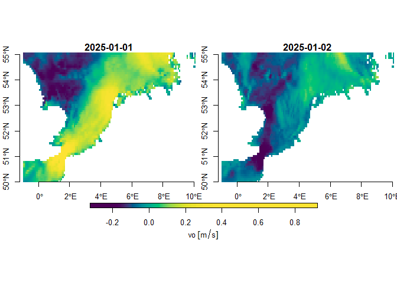
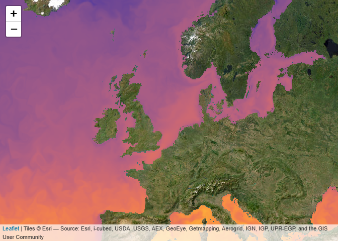

# CopernicusMarine 

<!-- badges: start -->

[](https://github.com/pepijn-devries/CopernicusMarine/actions/workflows/R-CMD-check.yaml)

[](https://CRAN.R-project.org/package=CopernicusMarine)
[](https://cran.r-project.org/web/checks/check_results_CopernicusMarine.html)
[](https://pepijn-devries.r-universe.dev/CopernicusMarine)
[](https://app.codecov.io/gh/pepijn-devries/CopernicusMarine?branch=master)
<!-- badges: end -->

## Overview

[Copernicus Marine Service
Information](https://marine.copernicus.eu/about) is a programme
subsidised by the European Commission. Its mission is to provide free
authoritative information on the oceans physical and biogeochemical
state. The `CopernicusMarine` R package is developed apart from this
programme and facilitates retrieval of information from
<https://data.marine.copernicus.eu>. With the package you can:

- List available marine data for Copernicus and provide
  meta-information.
- Download and use the data directly in R.

## Why use `CopernicusMarine`

Copernicus Marine offers access to their data services through a [Python
application interface](https://pypi.org/project/copernicusmarine/). For
R users this requires complex installation procedures and is difficult
to maintain in a stable R package. The `CopernicusMarine` R package has
a much simpler installation procedure (see below) and does not depend on
third party software, other than packages available from
[CRAN](https://cran.r-project.org/).

## Installation

Install CRAN release:

``` r
install.packages("CopernicusMarine")
```

Install latest developmental version from R-Universe:

``` r
install.packages("CopernicusMarine", repos = c('https://pepijn-devries.r-universe.dev', 'https://cloud.r-project.org'))
```

## Usage

The package provides an interface between R and the Copernicus Marine
services. Note that for some of these services you need an account and
have to comply with [specific
terms](https://marine.copernicus.eu/user-corner/service-commitments-and-licence).
The usage section briefly shows three different ways of obtaining data
from Copernicus:

- [Downloading a subset](#sec-subset)
- [Downloading a full dataset](#sec-full)
- [Using the WMTS server](#sec-wtms)

Please check the manual for complete documentation of the package.

<h3 id="sec-subset">

Downloading a subset
</h3>

The example below demonstrates how to subset a specific layer for a
specific product. The subset is constrained by the `region`, `timerange`
and `verticalrange` arguments. The subset is downloaded to memory
represented as a [`stars`](https://r-spatial.github.io/stars/) object.

``` r
my_data <-
  cms_download_subset(
    product       = "GLOBAL_ANALYSISFORECAST_PHY_001_024",
    layer         = "cmems_mod_glo_phy-cur_anfc_0.083deg_P1D-m",
    variable      = c("uo", "vo"),
    region        = c(-1, 50, 10, 55),
    timerange     = c("2025-01-01", "2025-01-02"),
    verticalrange = c(0, -2),
    progress      = FALSE
)

plot(my_data["vo"], col = hcl.colors(100), axes = TRUE)
```



<h3 id="sec-full">

Downloading a complete Copernicus marine product
</h3>

If you don’t want to subset the data and want the complete set, you can
download complete native files, if these are available for your product.
You can list available files with (restricted to first 10 results with
`max=10`):

``` r
native_files <-
  cms_list_native_files(
    "GLOBAL_ANALYSISFORECAST_PHY_001_024",
    "cmems_mod_glo_phy-cur_anfc_0.083deg_P1D-m",
    max = 10)
native_files
#> # A tibble: 10 × 9
#>    Key   LastModified ETag  Size  Owner_ID Owner_DisplayName StorageClass Bucket
#>    <chr> <chr>        <chr> <chr> <chr>    <chr>             <chr>        <chr> 
#>  1 nati… 2024-04-18T… "\"4… 1939… b8c2197… cloud_38953_ext_… STANDARD     mdl-n…
#>  2 nati… 2024-04-18T… "\"9… 1939… b8c2197… cloud_38953_ext_… STANDARD     mdl-n…
#>  3 nati… 2024-04-18T… "\"9… 1939… b8c2197… cloud_38953_ext_… STANDARD     mdl-n…
#>  4 nati… 2024-04-18T… "\"c… 1939… b8c2197… cloud_38953_ext_… STANDARD     mdl-n…
#>  5 nati… 2024-04-18T… "\"2… 1938… b8c2197… cloud_38953_ext_… STANDARD     mdl-n…
#>  6 nati… 2024-04-18T… "\"0… 1938… b8c2197… cloud_38953_ext_… STANDARD     mdl-n…
#>  7 nati… 2024-04-18T… "\"5… 1939… b8c2197… cloud_38953_ext_… STANDARD     mdl-n…
#>  8 nati… 2024-04-18T… "\"5… 1939… b8c2197… cloud_38953_ext_… STANDARD     mdl-n…
#>  9 nati… 2024-04-18T… "\"9… 1939… b8c2197… cloud_38953_ext_… STANDARD     mdl-n…
#> 10 nati… 2024-04-18T… "\"1… 1939… b8c2197… cloud_38953_ext_… STANDARD     mdl-n…
#> # ℹ 1 more variable: base_url <chr>
```

Downloading a specific (or multiple file) can be done with:

``` r
cms_download_native(
  destination   = tempdir(),
  product       = "GLOBAL_ANALYSISFORECAST_PHY_001_024",
  layer         = "cmems_mod_glo_phy_anfc_0.083deg_PT1H-m",
  prefix        = "2022/06/",
  pattern       = "m_20220630"
)
```

The file, whose file name matches the pattern, will be stored in the
specified destination folder. By default the progress is printed as
files can be very large and may take some time to download.

<h3 id="sec-wmts">

Copernicus Web Map Tile Services (WMTS)
</h3>

Web Map Tile Services (WMTS) allow to quickly plot pre-rendered images
onto a map. This may not be useful when you need the data for analyses
but is handy for quick visualisations, inspection or presentation of
data. In R it is very easy to add WMTS layers to an interactive map
using [leaflet](https://rstudio.github.io/leaflet/). This page is
rendered statically and resulting in a non-interactive map.

``` r
leaflet::leaflet() |>
  leaflet::setView(lng = 3, lat = 54, zoom = 4) |>
  leaflet::addProviderTiles("Esri.WorldImagery") |>
  addCmsWMTSTiles(
    product     = "GLOBAL_ANALYSISFORECAST_PHY_001_024",
    layer       = "cmems_mod_glo_phy-thetao_anfc_0.083deg_P1D-m",
    variable    = "thetao"
  )
```



### Citing the data you use

A Copernicus account comes with several terms of use. One of these is
that you [properly
cite](https://help.marine.copernicus.eu/en/articles/4444611-how-to-cite-copernicus-marine-products-and-services)
the data you use in publications. In fact, we also have credit the data
used in this documentation, which can be easily done with the following
code:

``` r
cms_cite_product("GLOBAL_ANALYSISFORECAST_PHY_001_024")$doi
#> [1] "E.U. Copernicus Marine Service Information; Global Ocean Physics Analysis and Forecast - GLOBAL_ANALYSISFORECAST_PHY_001_024 (2016-10-14). DOI:10.48670/moi-00016"
```

## Resources

- [E.U. Copernicus Marine Service
  Information](https://data.marine.copernicus.eu)
- [Global Ocean Physics Analysis and Forecast -
  GLOBAL_ANALYSISFORECAST_PHY_001_024 (2016-10-14);
  DOI:10.48670/moi-00016](https://doi.org/10.48670/moi-00016)

## Code of Conduct

Please note that the CopernicusMarine project is released with a
[Contributor Code of
Conduct](https://pepijn-devries.github.io/CopernicusMarine/CODE_OF_CONDUCT.html).
By contributing to this project, you agree to abide by its terms.
